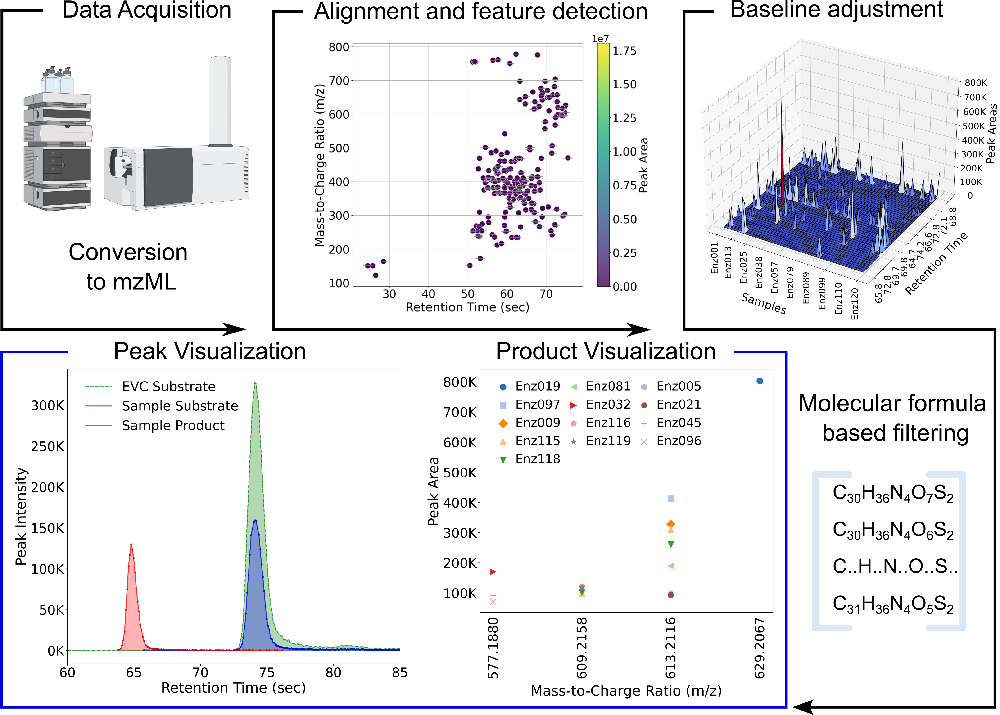

# EnzyMS LCMS Data Analysis Pipeline

The EnzyMS LCMS Data Analysis Pipeline is designed to streamline and automate the analysis of LCMS-QTOF data. This pipeline takes input in the form of SMILES files, parameter files for formula generation and feature detection, and sample lists, processes the data using specified configurations, and outputs analyzed data in a variety of formats including CSV and images.



## Features:

- **Automated LCMS Data Analysis**: Streamline the processing and analysis of LCMS data with a single pipeline.
- **Multiple Input Types**: Accepts SMILES files, parameter configuration files, and sample lists.
- **Customizable Analysis**: Adjust analysis parameters through the parameter file.
- **Versatile Output**: Generates a range of output files, including CSVs and images, which can be viewed or downloaded.

## Required Input

To run the LCMS Data Analysis Pipeline, you need the following inputs:

- **SMILES File** (`*.smi`): Contains the molecular structure in SMILES format.
- **Variations Parameter File** (`variations.param`); Contains adduct ion and mode information. Also contains information about atomic variations for anticipated products.  
- **Parameter File** (`parameters.yaml`): Configuration file specifying the analysis parameters.
- **Sample List File** (`list_of_samples.txt`): Contains the list of samples to be analyzed.
- **mzML Files** (`*.mzML`): Raw data files from LCMS to be analyzed. Agilent '.d' can be converted to .mzML format using ProteoWizard's msConvert program. [ProteoWizard](https://proteowizard.sourceforge.io/download.html)

## Installation and Usage

You can run the LCMS Data Analysis Pipeline in several ways:

### 1. Running as a Docker Container

#### Prerequisites
[Docker](https://docs.docker.com/get-docker/) must be installed on your system.

#### Steps to Run
1. **Build the Docker Image**:
    ```bash
    docker build -t enzyms .
    ```
2. **Run the Pipeline**:
    ```bash
    docker run --rm -v $(pwd)/input:/usr/src/app/input -v $(pwd)/output:/usr/src/app/output enzyms --smi_file /usr/src/app/input/CPD041.smi --variations_file ./variations.param --params_file /usr/src/app/input/parameters.yaml --samples_file /usr/src/app/input/list_of_samples.txt --mzml_dir /usr/src/app/input/mzML-files
    ```
    - `input`: Directory containing the input files.
    - `output`: Directory where the results will be saved.

### 2. Running as a Conda Environment

#### Prerequisites
[Anaconda](https://docs.anaconda.com/anaconda/install/) or [Miniconda](https://docs.conda.io/en/latest/miniconda.html) must be installed.

#### Steps to Install and Run
1. **Create a Conda Environment**:
    ```bash
    conda create -n enzyms python=3.11
    conda activate enzyms
    ```
2. **Install Required Packages**:
    ```bash
    pip install asari-metabolomics rdkit pyopenms pandas matplotlib numpy==1.24.4
    ```
3. **Run the Shell Script**:
    ```bash
    sh run_pipeline.sh --smi_file ./CPD041.smi --variations_file ./variations.param --params_file ./parameters.yaml --samples_file ./list_of_samples.txt --mzml_dir ./mzML-files
    ```

### 3. Running as a Web Application

#### Prerequisites
- [Anaconda](https://docs.anaconda.com/anaconda/install/) or [Miniconda](https://docs.conda.io/en/latest/miniconda.html) must be installed.
- [Flask](https://flask.palletsprojects.com/) and other dependencies as listed in `requirements.txt`.

#### Steps to Run
1. **Create a Conda Environment**:
    ```bash
    conda create -n enzyms-webapp python=3.11
    conda activate enzyms-webapp
    ```
2. **Install Required Packages**:
    ```bash
    pip install asari-metabolomics rdkit pyopenms pandas matplotlib numpy==1.24.4
    ```
3. **Run the Flask Application**:
    ```bash
    python enzyms_app.py
    ```
4. **Access the Web Application**:
    Open your web browser and navigate to [http://127.0.0.1:5000](http://127.0.0.1:5000). You can upload the required files and run the pipeline through the web interface.

